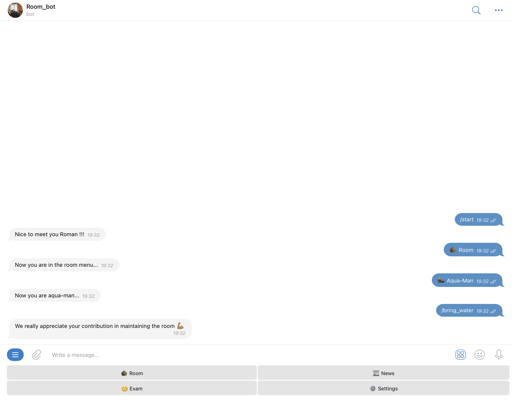

# 📚 Project Description
У нас были разные бытовые проблемы (такие как: кто должен принести воду, отчет по тому кто что купил и тд) с соседями по комнате. Из -за этого мы решили телеграмм бота на Golang 🙃.  Теперь мы оптимизировали данные процессы в нашей комнате. А также мы начали соревноваться, кто принес больше воды!!!

## 🎬 Demo



## 📝 Usage
    

## ✏️ Features

| Feature                                          | Supported |
|--------------------------------------------------|:---------:|
| Отмечать кто принес воду                         |     ✅     |
| Отмечать кто прибрался в комнате                 |     ✅     |
| Отправлять/получать отчет по покупкам в магазине |     ✅     |
| Отправлять/получать новости для комнаты          |     ✅     |
| Получать статистику по приносу воды              |     ✅     |
| Настройка получения уведомлений от бота          |     ✅     |

## 🎛️ Requirements
Requires ___ installed.
To install dependencies:
```

```

## ⚙️ Project Instalation

1. Install the requirements.
2. 

## 🐳 Running server inside docker container
    `docker-compose up`
    `docker-compose --profile=debug up`
    `docker-compose build app`
    `export $(cat env/*.env)`

## 🔧 Technologies & Tools


## 🎛️ Services
- MongoDB `localhost:27017`
- Redis `localhost:6379`
- DB viewer `localhost:8081`
